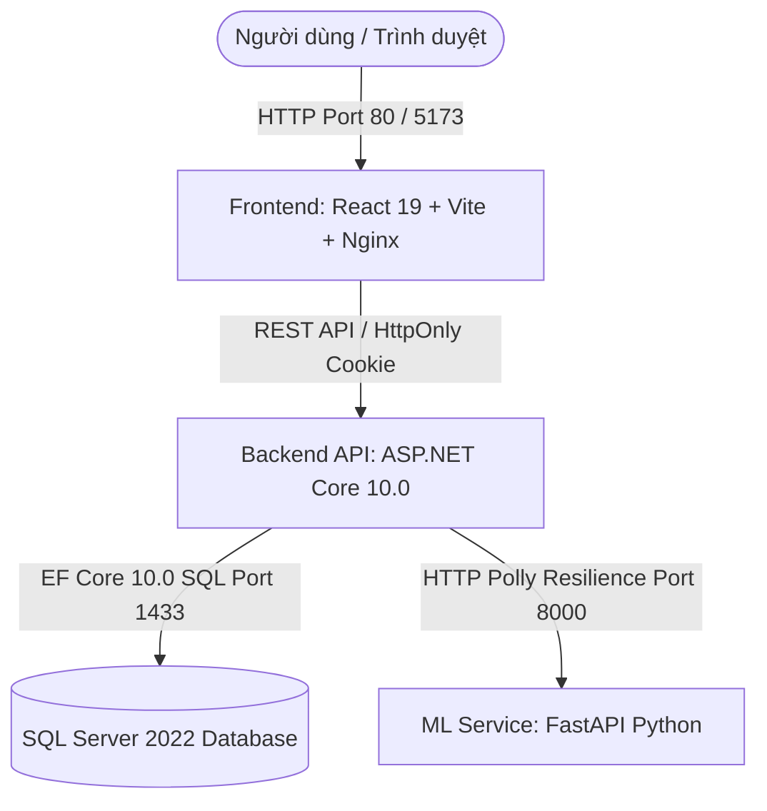

# 🎓 Edumy - Nền Tảng Học Trực Tuyến & Quản Lý Khóa Học (eLearning Platform)

Edumy là nền tảng quản lý và học trực tuyến toàn diện, tích hợp các công nghệ hiện đại bao gồm **ASP.NET Core Web API (Backend)**, **React 19 + Vite (Frontend)** và **FastAPI Machine Learning Service (ML Microservice)** nhằm mang lại trải nghiệm học tập cá nhân hóa, gợi ý khóa học thông minh và tự động kiểm duyệt nội dung.

---

## 📋 Mục Lục

- [1. Giới Thiệu Dự Án](#1-giới-thiệu-dự-án)
- [2. Các Tính Năng Hiện Có](#2-các-tính-năng-hiện-có)
- [3. Công Nghệ Sử Dụng](#3-công-nghệ-sử-dụng)
- [4. Kiến Trúc Hệ Thống](#4-kiến-trúc-hệ-thống)
- [5. Cấu Trúc Thư Mục Dự Án](#5-cấu-trúc-thư-mục-dự-án)
- [6. Yêu Cầu Hệ Thống](#6-yêu-cầu-hệ-thống)
- [7. Cấu Hình Môi Trường](#7-cấu-hình-môi-trường)
- [8. Thông Tin Database & Kết Nối](#8-thông-tin-database--kết-nối)
- [9. Tài Khoản Kiểm Thử (Seed Accounts)](#9-tài-khoản-kiểm-thử-seed-accounts)
- [10. Danh Sách Service & Địa Chỉ Localhost](#10-danh-sách-service--địa-chỉ-localhost)
- [11. Hướng Dẫn Chạy Nhanh Bằng Docker](#11-hướng-dẫn-chạy-nhanh-bằng-docker)
- [12. Hướng Dẫn Build & Chạy Thủ Công (Không Dùng Docker)](#12-hướng-dẫn-build--chạy-thủ-công-không-dùng-docker)
- [13. Quy Trình Build Production](#13-quy-trình-build-production)
- [14. Database Migration & Update](#14-database-migration--update)
- [15. Bảng Các Lệnh Thường Dùng](#15-bảng-các-lệnh-thường-dùng)
- [16. Swagger UI & Danh Sách API Endpoints](#16-swagger-ui--danh-sách-api-endpoints)
- [17. Luồng Sử Dụng Theo Role](#17-luồng-sử-dụng-theo-role)
- [18. Dữ Liệu Mẫu & Cơ Chế Seeding](#18-dữ-liệu-mẫu--cơ-chế-seeding)
- [19. Quản Lý File Upload & Ảnh Khóa Học](#19-quản-lý-file-upload--ảnh-khóa-học)
- [20. Xác Thực & Quản Lý Phiên Đăng Nhập](#20-xác-thực--quản-lý-phiên-đăng-nhập)
- [21. Xử Lý Lỗi Thường Gặp (Troubleshooting)](#21-xử-lý-lỗi-thường-gặp-troubleshooting)
- [22. Ghi Chú Bảo Mật](#22-ghi-chú-bảo-mật)
- [23. Trạng Thái & Giới Hạn Hiện Tại](#23-trạng-thái--giới-hạn-hiện-tại)

---

## 1. Giới Thiệu Dự Án

### Mục Tiêu Dự Án
Edumy được xây dựng nhằm cung cấp giải pháp chuyển đổi số cho môi trường giáo dục trực tuyến. Hệ thống cho phép Giảng viên tạo và bán các khóa học chất lượng cao, giúp Học viên tiếp cận kho kiến thức đa dạng và cấp quyền Quản trị toàn diện cho Admin.

### Nhóm Người Dùng Chính
1. **Học viên (Student):** Tìm kiếm, lọc, lưu khóa học yêu thích, mua khóa học qua giỏ hàng/thanh toán giả lập, theo dõi tiến độ bài học, làm bài kiểm tra trắc nghiệm (Quiz), nhận chứng chỉ, đánh giá và đặt câu hỏi thảo luận.
2. **Giảng viên (Instructor):** Xem Dashboard thống kê doanh thu, quản lý danh sách khóa học thuộc sở hữu, tạo/chỉnh sửa nội dung chương bài học (Curriculum Builder), xem thông số đánh giá cảm xúc khóa học từ AI, phản hồi nhận xét và câu hỏi thảo luận.
3. **Quản trị viên (Admin):** Quản lý toàn bộ danh sách người dùng (khóa/mở tài khoản, xóa tài khoản), duyệt hoặc hủy xuất bản khóa học, quản lý mã giảm giá (Coupon), theo dõi doanh số toàn hệ thống và xử lý nội dung báo xấu.

---

## 2. Các Tính Năng Hiện Có

### 🎓 Học Viên (Student)
- **Xác thực:** Đăng ký, đăng nhập JWT, đăng nhập Google (hoặc Mock OAuth), quên/đặt lại mật khẩu.
- **Khám phá khóa học:** Xem danh sách khóa học, tìm kiếm Autocomplete, lọc theo danh mục (Category), xem chi tiết khóa học và thông tin giảng viên.
- **Yêu thích & Giỏ hàng:** Thêm/xóa khóa học khỏi Wishlist, thêm/xóa giỏ hàng (Cart), áp dụng mã giảm giá (Coupon).
- **Thanh toán:** Thanh toán đơn hàng giả lập (Mock Payment Gateway), nhận thông báo hoàn tất đơn hàng.
- **Học tập & Tiến độ:** Trang "Khóa học của tôi" (My Learning), trình phát video/bài học (Course Player), tự động lưu vết % hoàn thành bài học (Lesson Progress).
- **Đánh giá & Thảo luận:** Làm bài trắc nghiệm (Quiz Attempt), xem và tải chứng chỉ (Certificate), gửi đánh giá/sao (Review), đặt câu hỏi thảo luận bài học (Discussions).
- **Cá nhân:** Xem/chỉnh sửa thông tin cá nhân (Profile), tự xóa tài khoản cá nhân.

### 👨‍🏫 Giảng Viên (Instructor)
- **Dashboard:** Thống kê tổng doanh thu, số học viên ghi danh, đánh giá trung bình, biểu đồ doanh số hàng tháng và phân tích cảm xúc đánh giá từ ML.
- **Quản lý khóa học:** Tạo khóa học mới, chỉnh sửa thông tin chi tiết, tải lên ảnh thumbnail.
- **Xây dựng chương trình học (Curriculum Builder):** Quản lý Chương (Section) và Bài học (Lesson), sắp xếp thứ tự, gắn tài liệu/video.
- **Tương tác:** Quản lý và phản hồi thảo luận của học viên trong từng khóa học, phản hồi đánh giá của học viên.
- **Xóa khóa học:** Cho phép xóa các khóa học thuộc quyền sở hữu của giảng viên.

### 🛡️ Quản Trị Viên (Admin)
- **Quản lý người dùng:** Xem danh sách tất cả tài khoản, tìm kiếm, khóa (IsActive = false) / mở khóa tài khoản, xóa tài khoản người dùng.
- **Quản lý khóa học:** Duyệt xuất bản khóa học (Publish), hủy xuất bản (Unpublish), xóa khóa học vi phạm, ghi đè chủ đề dự đoán bởi ML.
- **Quản lý Mã giảm giá (Coupon):** Tạo mới, chỉnh sửa, xóa và bật/tắt trạng thái mã giảm giá.
- **Báo cáo & Thống kê:** Xem doanh số bán hàng gần đây, quản lý toàn bộ thảo luận và phản hồi trên nền tảng.

### ⚙️ Tính Năng Chung & Nền Tảng
- **Hệ thống Danh mục:** Cấu trúc phân loại theo danh mục cha/con, cập nhật tự động.
- **Phân loại & Kiểm duyệt ML (Auto-Moderation):** 
  - Đề xuất danh mục khóa học dựa trên tiêu đề & mô tả.
  - Phân tích cảm xúc nhận xét (Positive/Negative sentiment analysis).
  - Kiểm tra từ ngữ độc hại/nhạy cảm (Toxicity Detection).
- **Thông báo (Notifications):** Hệ thống thông báo thời gian thực nội bộ cho người dùng.
- **Xác thực JWT An Toàn:** Lưu trữ Refresh Token trong `HttpOnly Cookie`, tự động gia hạn Access Token.
- **Khôi phục dữ liệu an toàn:** Hỗ trợ xóa mềm (Soft Delete) đối với khóa học và danh mục.

---

## 3. Công Nghệ Sử Dụng

| Nhóm | Công nghệ / Thư viện | Phiên bản thực tế | Vai trò trong hệ thống |
| :--- | :--- | :--- | :--- |
| **Backend Framework** | ASP.NET Core Web API | `.NET 10.0` (`net10.0`) | Xử lý logic nghiệp vụ API, Routing & Middleware |
| **ORM / Data Access** | Entity Framework Core | `10.0.10` | Quản lý ORM, Migration & tương tác SQL Server |
| **Database** | Microsoft SQL Server | `2022-latest` | Cơ sở dữ liệu quan hệ chính |
| **Authentication** | JWT Bearer & BCrypt | `10.0.10` / `4.2.0` | Mã hóa mật khẩu, cấp phát & xác thực token |
| **Resilience / Retry** | Polly (`Microsoft.Extensions.Http.Polly`) | `10.0.10` | Xử lý Retry & Circuit Breaker khi gọi ML Service |
| **Logging** | Serilog | `10.0.0` | Ghi log hệ thống ra Console và File nhật ký |
| **Payment Integration** | Stripe.net | `52.1.1` | Tích hợp cổng thanh toán trực tuyến |
| **API Documentation** | Swashbuckle (Swagger) | `10.2.3` | Tạo giao diện thử nghiệm API tương tác |
| **Frontend Framework** | React | `19.2.7` | Xây dựng giao diện Single Page Application (SPA) |
| **Build Tool (Frontend)** | Vite | `8.1.1` | Đóng gói và chạy môi trường Development Frontend |
| **UI Components & Style** | Bootstrap / Lucide Icons / Framer Motion | `5.3.8` / `1.25.0` / `12.42.2` | Giao diện người dùng, icon và hiệu ứng chuyển động |
| **HTTP Client (Frontend)** | Axios | `1.18.1` | Gửi yêu cầu HTTP REST API có cấu hình Interceptors |
| **ML Microservice** | Python FastAPI & Uvicorn | Python `3.12-slim` / `3.11+` | Service AI xử lý phân loại, sentiment & gợi ý |
| **ML Libraries** | NumPy, Pandas, Scikit-learn, TensorFlow, Joblib | Mới nhất trong `requirements.txt` | Thuật toán Machine Learning & xử lý dữ liệu |
| **Web Server (Docker)** | Nginx | `alpine` | Reverse proxy và serve tĩnh cho React Frontend |
| **Containerization** | Docker & Docker Compose | Docker Compose Schema v3 | Đóng gói toàn bộ hệ thống vào containers |

---

## 4. Kiến Trúc Hệ Thống



### Chi Tiết Luồng Kết Nối
1. **Frontend (React)** gửi yêu cầu HTTP REST API tới **Backend (ASP.NET Core)**. Access Token được đính kèm trong header `Authorization: Bearer <token>`, còn Refresh Token được lưu trong `HttpOnly Cookie`.
2. **Backend API** sử dụng **EF Core 10.0** để truy xuất dữ liệu từ **SQL Server 2022**.
3. Khi khởi tạo khóa học hoặc gửi đánh giá, **Backend API** gọi sang **ML Service (FastAPI)** qua cổng `8000` (sử dụng cơ chế Retry 2 lần và Circuit Breaker từ Polly).
4. Trong môi trường Docker Compose, **Nginx** phục vụ build artifact của Frontend tại cổng `80` và chuyển tiếp các request `/api/` về container `backend:8080`.

---

## 5. Cấu Trúc Thư Mục Dự Án

```text
Edumy/
├── Backend/                                # Mã nguồn ASP.NET Core Web API
│   ├── Controllers/                        # 25 API Controllers xử lý các endpoint
│   ├── Data/                               # ApplicationDbContext & DataSeeder
│   ├── DTOs/                               # Data Transfer Objects
│   ├── Middlewares/                        # ExceptionMiddleware & ActiveUserMiddleware
│   ├── Migrations/                         # Các bản Entity Framework Core Migration
│   ├── Models/                             # Các Entity Models trong cơ sở dữ liệu
│   ├── Properties/                         # launchSettings.json (Cấu hình cổng local)
│   ├── Services/                           # Services nghiệp vụ (Coupon, Progress, ML, v.v.)
│   ├── wwwroot/                            # Lưu trữ file tĩnh & ảnh uploads
│   ├── appsettings.json                    # Cấu hình môi trường chính
│   ├── appsettings.Development.json        # Cấu hình môi trường Development
│   ├── Dockerfile                          # Dockerfile đa tầng đóng gói Backend
│   └── EduMy.Backend.csproj                # File quản lý dependencies .NET
├── Frontend/                               # Mã nguồn React 19 Client
│   ├── src/                                # Source code React
│   │   ├── api/                            # Axios config & interceptors
│   │   ├── components/                     # Các React Components dùng chung
│   │   ├── context/                        # AuthContext quản lý trạng thái đăng nhập
│   │   ├── pages/                          # Các trang màn hình chính của ứng dụng
│   │   └── App.jsx                         # Cấu hình Routing chính của React Router
│   ├── Dockerfile                          # Dockerfile đóng gói React + Nginx
│   ├── nginx.conf                          # Cấu hình Nginx reverse proxy
│   ├── package.json                        # Khai báo npm dependencies & scripts
│   └── vite.config.js                      # Cấu hình Vite build tool
├── MLService/                              # Microservice AI Python FastAPI
│   ├── config/                             # Cấu hình nội bộ cho ML
│   ├── services/                           # Recommendation Mapping Services
│   ├── main.py                             # Khởi tạo ứng dụng FastAPI & REST Endpoints
│   ├── hybrid_inference.py                 # Thuật toán dự đoán lai (Rules + Model)
│   ├── Dockerfile                          # Dockerfile đóng gói Python ML Service
│   └── requirements.txt                    # Danh sách thư viện Python cần thiết
├── docker-compose.yml                      # Cấu hình khởi chạy toàn bộ hệ thống Docker
└── README.md                               # Tài liệu hướng dẫn dự án
```

---

## 6. Yêu Cầu Hệ Thống

Để phát triển hoặc khởi chạy dự án, hệ thống cần đáp ứng các yêu cầu sau:

- **Chạy bằng Docker (Khuyên dùng):**
  - **Docker Engine:** Version 20.10.0+
  - **Docker Compose:** Version v2.0.0+

- **Chạy thủ công (Không dùng Docker):**
  - **.NET SDK:** `.NET 10.0 SDK` (Bắt buộc để build Backend)
  - **Node.js:** `v20.0.0+` (Kèm `npm` v10.0.0+)
  - **Python:** `Python 3.11` hoặc `3.12`
  - **SQL Server:** Microsoft SQL Server 2022 (hoặc SQL Server Express / LocalDB)

---

## 7. Cấu Hình Môi Trường

Dưới đây là danh sách các biến môi trường thực tế được sử dụng trong dự án:

| Biến môi trường | Service sử dụng | Ý nghĩa | Giá trị Mặc định / Dev | Bắt buộc |
| :--- | :--- | :--- | :--- | :---: |
| `ASPNETCORE_ENVIRONMENT` | Backend | Môi trường ứng dụng ASP.NET | `Development` | Có |
| `ConnectionStrings__DefaultConnection` | Backend | Chuỗi kết nối SQL Server | *Xem chi tiết Mục 8* | Có |
| `MSSQL_SA_PASSWORD` | SQL Server | Mật khẩu tài khoản SA của SQL Server | `EduMySuperSecurePassword123!` | Có |
| `ACCEPT_EULA` | SQL Server | Chấp nhận điều khoản Microsoft SQL | `Y` | Có |
| `PORT` | ML Service | Cổng lắng nghe của FastAPI | `8000` | Không |
| `MachineLearning__BaseUrl` / `MLServiceUrl` | Backend | URL gọi sang ML Microservice | `http://ml-service:8000` (Docker) / `http://localhost:8000` (Local) | Có |
| `Jwt__Key` | Backend | Khóa đối xứng mã hóa JWT | `ThisIsASecretKeyForJwtAuthenticationInEduMyProject_PleaseChangeInProduction` | Có |
| `Jwt__Issuer` | Backend | Nhà phát hành Token | `EduMyBackend` | Có |
| `Jwt__Audience` | Backend | Đối tượng nhận Token | `EduMyClient` | Có |
| `Jwt__AccessTokenMinutes` | Backend | Thời gian sống của Access Token | `120` (Phút) | Không |
| `Jwt__RefreshTokenDays` | Backend | Thời gian sống của Refresh Token | `30` (Ngày) | Không |
| `VITE_API_URL` | Frontend | URL gốc API của Backend | `/api` (Docker Nginx) / Không đặt (Dùng mặc định) | Không |

---

## 8. Thông Tin Database & Kết Nối

Cơ sở dữ liệu sử dụng **Microsoft SQL Server 2022** với tên Database mặc định là **`EduMyDb`**.

### Bảng Thông Số Kết Nối Theo Ngữ Cảnh

| Ngữ cảnh | Hostname / Server | Port Internal | Port Expose | Database | Username | Password Development |
| :--- | :--- | :---: | :---: | :--- | :--- | :--- |
| **Docker Compose** | `sqlserver` *(Tên Docker Service)* | `1433` | `1433` | `EduMyDb` | `sa` | `EduMySuperSecurePassword123!` |
| **Local Host (SSMS / Azure Studio)** | `localhost` hoặc `127.0.0.1` | `1433` | `1433` | `EduMyDb` | `sa` | `EduMySuperSecurePassword123!` |
| **Local Host (LocalDB mặc định)** | `(localdb)\mssqllocaldb` | - | - | `EduMyDb` | *Windows Auth* | *N/A* |

### Connection Strings Thực Tế Trong Source

1. **Connection String trong Docker Compose (`docker-compose.yml`):**
   ```text
   Server=sqlserver;Database=EduMyDb;User Id=sa;Password=EduMySuperSecurePassword123!;TrustServerCertificate=True;
   ```

2. **Connection String trong `Backend/appsettings.json` (LocalDB):**
   ```text
   Server=(localdb)\mssqllocaldb;Database=EduMyDb;Trusted_Connection=True;MultipleActiveResultSets=true
   ```

3. **Connection String khi chạy Backend với SQL Server Docker (Khuyên dùng khi dev local):**
   ```text
   Server=localhost,1433;Database=EduMyDb;User Id=sa;Password=EduMySuperSecurePassword123!;TrustServerCertificate=True;
   ```

- **Volume lưu dữ liệu Docker:** `sqlserver_data` (gắn vào `/var/opt/mssql` trong container).
- **Trạng thái Migration & Seeding:** Tự động thực thi mỗi khi Backend khởi động (`db.Database.Migrate()` và `DataSeeder.Initialize()`).

---

## 9. Tài Khoản Kiểm Thử (Seed Accounts)

Hệ thống được khởi tạo sẵn các tài khoản thử nghiệm thông qua `DataSeeder.cs` với mật khẩu dùng chung là `123123`:

> [!IMPORTANT]  
> Các mật khẩu `123123` chỉ dùng cho môi trường local/demo.  
> Không sử dụng mật khẩu này trong production.

| Role | Họ và tên | Email | Mật khẩu | Ghi chú |
| :--- | :--- | :--- | :--- | :--- |
| **Admin** | System Admin | `admin@edumy.com` | `123123` | Quyền Quản trị viên cao nhất |
| **Instructor** | John Doe | `instructor@edumy.com` | `123123` | Giảng viên chính mẫu |
| **Instructor** | Jane Miller | `instructor2@edumy.com` | `123123` | Giảng viên mẫu 2 |
| **Instructor** | Bob Smith | `instructor3@edumy.com` | `123123` | Giảng viên mẫu 3 |
| **Instructor** | An Nguyen ... Minh Le | `instructor04@edumy.com` đến `instructor12@edumy.com` | `123123` | 9 Giảng viên chuyên ngành |
| **Student** | Edumy Student 01 | `student@edumy.com` | `123123` | Học viên mẫu 1 (Có lịch sử mua hàng) |
| **Student** | Edumy Student 02 | `student2@edumy.com` | `123123` | Học viên mẫu 2 |
| **Student** | Edumy Student 03 | `hung@h.com` | `123123` | Tài khoản học viên thử nhanh |
| **Student** | Edumy Student 04 ... 40 | `seedstudent04@edumy.com` đến `seedstudent40@edumy.com` | `123123` | 37 Học viên seed dữ liệu |

---

## 10. Danh Sách Service & Địa Chỉ Localhost

| Service | Môi trường Docker | Môi trường Dev Local | Mô tả / Endpoints quan trọng |
| :--- | :--- | :--- | :--- |
| **Frontend App** | `http://localhost` (Port 80) | `http://localhost:5173` | Giao diện React SPA chính |
| **Backend API** | `http://localhost:5000` (Container 8080) | `http://localhost:5150` | Gateway xử lý REST API |
| **Swagger UI** | `http://localhost:5000/swagger` | `http://localhost:5150/swagger` | Tài liệu API tương tác |
| **Backend Health** | `http://localhost:5000/health` | `http://localhost:5150/health` | Endpoint kiểm tra sức khỏe Backend & DB |
| **ML Microservice** | `http://localhost:8000` | `http://localhost:8000` | FastAPI Microservice AI |
| **ML OpenAPI Docs** | `http://localhost:8000/docs` | `http://localhost:8000/docs` | Swagger riêng của FastAPI |
| **ML Health Check** | `http://localhost:8000/recommendation/health` | `http://localhost:8000/recommendation/health` | Kiểm tra trạng thái tải mô hình AI |
| **SQL Server** | `localhost:1433` | `localhost:1433` | Cổng kết nối cơ sở dữ liệu |
| **Static Uploads** | `http://localhost:5000/uploads/...` | `http://localhost:5150/uploads/...` | Truy cập ảnh/file tĩnh tải lên |

---

## 11. Hướng Dẫn Chạy Nhanh Bằng Docker

### Khởi Động Toàn Bộ Hệ Thống
Mở terminal tại thư mục gốc dự án:
```bash
docker compose up -d --build
```

### Kiểm Tra Trạng Thái Dịch Vụ
```bash
docker compose ps
```

### Xem Log Nhật Ký (Logs)
```bash
# Xem log tất cả các service
docker compose logs -f

# Xem log từng service cụ thể
docker compose logs -f backend
docker compose logs -f frontend
docker compose logs -f ml-service
docker compose logs -f sqlserver
```

### Dừng Dịch Vụ
```bash
# Dừng container nhưng giữ nguyên dữ liệu database
docker compose down

# WARNING: Dừng container VÀ XÓA SẠCH dữ liệu volume SQL Server (Dùng để reset sạch)
docker compose down -v
```

### Thứ Tự Khởi Động Tự Động Trong Docker
1. **SQL Server (`edumy_sqlserver`):** Khởi chạy và chờ đạt trạng thái `healthy` qua healthcheck `sqlcmd`.
2. **ML Service (`edumy_mlservice`):** Khởi chạy FastAPI trên cổng `8000`.
3. **Backend (`edumy_backend`):** Chờ SQL Server healthy -> Tự chạy DB Migration & Seeding -> Lắng nghe cổng `8080` (expose sang host port `5000`).
4. **Frontend (`edumy_frontend`):** Chờ Backend healthy -> Khởi chạy Nginx cổng `80`.

---

## 12. Hướng Dẫn Build & Chạy Thủ Công (Không Dùng Docker)

Cần mở **3 cửa sổ Terminal** riêng biệt cho 3 dịch vụ:

### 1️⃣ Bước 1: Khởi Chạy SQL Server
Có thể chạy container SQL Server độc lập qua Docker:
```bash
docker run -e "ACCEPT_EULA=Y" -e "MSSQL_SA_PASSWORD=EduMySuperSecurePassword123!" -p 1433:1433 --name edumy_sqlserver_standalone -d mcr.microsoft.com/mssql/server:2022-latest
```

### 2️⃣ Bước 2: Chạy Backend (ASP.NET Core)
```bash
cd Backend
dotnet restore
dotnet build
dotnet run
```
*Backend sẽ chạy tại `http://localhost:5150`.*

### 3️⃣ Bước 3: Chạy ML Service (FastAPI)
- **Trên Windows PowerShell:**
  ```powershell
  cd MLService
  python -m venv venv
  .\venv\Scripts\Activate.ps1
  pip install -r requirements.txt
  uvicorn main:app --reload --host 0.0.0.0 --port 8000
  ```

- **Trên Linux / macOS:**
  ```bash
  cd MLService
  python3 -m venv venv
  source venv/bin/activate
  pip install -r requirements.txt
  uvicorn main:app --reload --host 0.0.0.0 --port 8000
  ```
*ML Service sẽ chạy tại `http://localhost:8000`.*

### 4️⃣ Bước 4: Chạy Frontend (React + Vite)
```bash
cd Frontend
npm install
npm run dev
```
*Frontend sẽ chạy tại `http://localhost:5173`.*

---

## 13. Quy Trình Build Production

### Đóng Gói Backend
```bash
cd Backend
dotnet publish EduMy.Backend.csproj -c Release -o ./publish
```

### Đóng Gói Frontend
```bash
cd Frontend
npm run build
```
*File kết quả nằm trong thư mục `Frontend/dist`.*

---

## 14. Database Migration & Update

Entity Framework Core DbContext nằm trong project `Backend`.

### Các Câu Lệnh EF Core CLI

```bash
# Xem danh sách các migration đã tạo
dotnet ef migrations list --project Backend

# Áp dụng migration vào Database thủ công
dotnet ef database update --project Backend

# Tạo migration mới (khi chỉnh sửa Model)
dotnet ef migrations add <MigrationName> --project Backend
```

- **Tự động áp dụng:** Khi ứng dụng Backend khởi động, code trong `Program.cs` sẽ gọi `EduMy.Backend.Data.DataSeeder.Initialize()`, trong đó thực hiện `db.Database.Migrate()` tự động.
- **Tính Idempotent của Seeder:** `DataSeeder` sử dụng các hàm kiểm tra `Any()` trước khi thêm mới (ví dụ `if (!db.Roles.Any(...))`), giúp đảm bảo dữ liệu không bị lặp lại khi khởi động lại ứng dụng.

---

## 15. Bảng Các Lệnh Thường Dùng

| Thành phần | Lệnh thực thi | Mô tả |
| :--- | :--- | :--- |
| **Backend** | `dotnet restore` | Tải các package NuGet |
| **Backend** | `dotnet build` | Biên dịch project Backend |
| **Backend** | `dotnet run` | Chạy ứng dụng Backend API |
| **Frontend** | `npm install` | Cài đặt npm packages |
| **Frontend** | `npm run dev` | Chạy giao diện ở chế độ Development |
| **Frontend** | `npm run build` | Đóng gói giao diện cho Production |
| **Frontend** | `npm run lint` | Kiểm tra lỗi code style với oxlint |
| **Frontend** | `npm test` | Chạy test đơn vị phía Frontend |
| **ML Service** | `pip install -r requirements.txt` | Cài đặt thư viện Python ML |
| **ML Service** | `uvicorn main:app --reload --port 8000` | Khởi chạy server FastAPI |
| **Docker** | `docker compose up -d --build` | Khởi tạo và chạy ngầm các container |
| **Docker** | `docker compose down -v` | Xóa container và reset dữ liệu Volume |

---

## 16. Swagger UI & Danh Sách API Endpoints

- **Địa chỉ Swagger UI:** `http://localhost:5000/swagger` (Docker) hoặc `http://localhost:5150/swagger` (Dev).
- **Cơ chế xác thực trên Swagger:** Bấm vào nút **Authorize**, nhập `Bearer <your_access_token>`.

### 25 Nhóm Controller API Chính

1. `/api/auth`: Đăng ký, đăng nhập, refresh token, revoke token, forgot/reset password.
2. `/api/account`: Cập nhật mật khẩu, tự xóa tài khoản cá nhân.
3. `/api/users`: Quản lý thông tin profile người dùng.
4. `/api/admin`: Quản lý người dùng, khóa tài khoản, duyệt khóa học, thống kê hệ thống.
5. `/api/instructor`: Dashboard giảng viên, thống kê doanh thu, đánh giá cảm xúc.
6. `/api/courses`: Danh sách khóa học, chi tiết khóa học, tạo/sửa/xóa khóa học.
7. `/api/categories`: Danh mục khóa học (lấy danh sách, tạo/sửa danh mục).
8. `/api/curriculum`: Quản lý chương (Section) và bài học (Lesson).
9. `/api/lessons`: Chi tiết bài học.
10. `/api/learning`: Lấy danh sách khóa học đã đăng ký của học viên.
11. `/api/cart`: Quản lý giỏ hàng học viên.
12. `/api/wishlist`: Quản lý danh sách khóa học yêu thích.
13. `/api/orders`: Tạo đơn hàng và xem lịch sử mua hàng.
14. `/api/payment`: Xử lý thanh toán và callback thanh toán.
15. `/api/reviews`: Gửi đánh giá, sửa đánh giá, phân tích cảm xúc từ AI.
16. `/api/discussions`: Đặt câu hỏi và phản hồi thảo luận trong bài học.
17. `/api/quizzes`: Quản lý bài kiểm tra trắc nghiệm.
18. `/api/quizattempts`: Thực hiện và nộp bài làm trắc nghiệm.
19. `/api/certificates`: Cấp và xem chứng chỉ hoàn thành khóa học.
20. `/api/coupons`: Áp dụng và quản lý mã giảm giá.
21. `/api/notifications`: Quản lý thông báo người dùng.
22. `/api/uploads`: Tải lên file media/ảnh.
23. `/api/media`: Quản lý các file truyền thông.
24. `/api/tags`: Quản lý thẻ chủ đề.
25. `/api/mltest`: Endpoint kiểm thử tích hợp ML Service.

---

## 17. Luồng Sử Dụng Theo Role

### 👨‍🎓 Học Viên (Student)
`Đăng nhập` ➔ `Trang chủ / Tìm kiếm khóa học` ➔ `Thêm vào Giỏ hàng / Wishlist` ➔ `Thanh toán đơn hàng (Mock Payment)` ➔ `Vào "Khóa học của tôi" (/my-courses)` ➔ `Mở trình phát bài học (/my-courses/:id/learn)` ➔ `Làm Quiz & Nhận chứng chỉ` ➔ `Gửi Đánh giá & Thảo luận`.

### 👨‍🏫 Giảng Viên (Instructor)
`Đăng nhập` ➔ `Truy cập Dashboard (/instructor)` ➔ `Tạo khóa học mới (/instructor/courses/new)` ➔ `Xây dựng nội dung bài học trong Curriculum Builder` ➔ `Tải lên Thumbnail` ➔ `Xuất bản / Gửi duyệt ML` ➔ `Xem thống kê doanh số & phản hồi học viên`.

### 🛡️ Quản Trị Viên (Admin)
`Đăng nhập` ➔ `Truy cập Trang quản trị (/admin)` ➔ `Xem danh sách người dùng (Khóa/Xóa tài khoản vi phạm)` ➔ `Duyệt/Hủy xuất bản khóa học` ➔ `Quản lý mã giảm giá Coupon` ➔ `Ghi đè gợi ý danh mục từ ML`.

---

## 18. Dữ Liệu Mẫu & Cơ Chế Seeding

`DataSeeder` tự động khởi chạy khi ứng dụng start up và thực hiện seed các dữ liệu sau:
- **Roles:** `Admin`, `Instructor`, `Student`.
- **Users:** 1 Admin, 12 Instructors, 40 Students.
- **Categories:** 12 Danh mục chính (*Development, Business, Design, Marketing, IT & Software, Office Productivity, Personal Development, Photography, Data Science, Cloud Computing, Cyber Security, Mobile Development*) và 1 danh mục *Uncategorized*.
- **Courses:** Hơn 20 khóa học mẫu kèm theo Chương (Sections), Bài học (Lessons), Trắc nghiệm (Quizzes), Đăng ký học (Enrollments), Đánh giá (Reviews) và Mã giảm giá (Coupons).

---

## 19. Quản Lý File Upload & Ảnh Khóa Học

- **Định dạng hỗ trợ:** `.jpg`, `.jpeg`, `.png`, `.gif`, `.webp`, `.mp4`, `.pdf`.
- **Thư mục lưu trữ:** `Backend/wwwroot/uploads/`.
- **Đường dẫn truy cập static:** `http://localhost:5000/uploads/<filename>` (Docker) hoặc `http://localhost:5150/uploads/<filename>` (Dev).
- **Lưu ý trong Docker:** Trong cấu hình `docker-compose.yml` hiện tại, thư mục `wwwroot/uploads` chưa được gắn với volume ngoài host. Do đó, nếu xóa container `edumy_backend`, các file vừa tải lên sẽ bị làm mới về trạng thái mặc định của container.

---

## 20. Xác Thực & Quản Lý Phiên Đăng Nhập

- **Access Token:** Định dạng JWT Bearer Token, có thời hạn `120 phút`, được trả về trong JSON response khi đăng nhập và lưu tại `localStorage` phía Frontend.
- **Refresh Token:** Lưu trữ an toàn trong `HttpOnly Cookie` (tên cookie `refreshToken`), có thời hạn `30 ngày`.
- **Cơ chế gia hạn tự động:** Axios Interceptors phía Frontend (`axiosConfig.js`) sẽ bắt mã lỗi `401 Unauthorized`, tự động gọi `/api/auth/refresh-token` để lấy Access Token mới mà không làm gián đoạn trải nghiệm người dùng.
- **Khóa tài khoản (Account Inactive):** Khi tài khoản bị Admin khóa (`IsActive = false`), middleware `ActiveUserMiddleware` sẽ chặn với mã lỗi `403 ACCOUNT_INACTIVE`, tự động xóa phiên đăng nhập và điều hướng người dùng về trang Login.

---

## 21. Xử Lý Lỗi Thường Gặp (Troubleshooting)

| Dấu hiệu lỗi | Nguyên nhân phổ biến | Cách xử lý an toàn |
| :--- | :--- | :--- |
| **Backend không khởi động được (Lỗi DB Connection)** | SQL Server chưa sẵn sàng hoặc sai mật khẩu SA | Kiểm tra container `edumy_sqlserver` bằng `docker compose ps`. Đảm bảo password đúng `EduMySuperSecurePassword123!`. |
| **ML Service unavailable / Status Degraded** | Chưa cài đủ thư viện Python hoặc chưa tải được model | Kiểm tra log ML Service bằng `docker compose logs ml-service` hoặc chạy `pip install -r requirements.txt` khi chạy local. |
| **Lỗi CORS khi gọi API từ Frontend** | Chưa cấu hình origin đúng trong Backend | Backend đã bật chính sách `AllowAll` với `AllowCredentials()`. Kiểm tra xem Frontend có gửi request đúng URL Backend không. |
| **Lỗi `0x800711C7` khi chạy `dotnet ef` trên Windows** | Chính sách AppLocker / Windows Security chặn file thực thi | Khuyên dùng Docker để chạy Migration hoặc cấu hình lại quyền ứng dụng trên Windows. |
| **Không tải được dữ liệu Categories khi mới bật** | Database đang trong quá trình Seeding | Chờ 10-15 giây để `DataSeeder` hoàn tất khởi tạo dữ liệu trong lần chạy đầu tiên. |

---

## 22. Ghi Chú Bảo Mật

> [!WARNING]
> các thông tin cấu hình kết nối, mật khẩu database SA (`EduMySuperSecurePassword123!`), khóa bí mật JWT (`Jwt:Key`) và các tài khoản thử nghiệm trong tài liệu này **chỉ phục vụ mục đích kiểm thử và phát triển ở môi trường Local/Development**. Khi triển khai sản phẩm lên môi trường Production, bắt buộc phải thay đổi toàn bộ credential và sử dụng biến môi trường hoặc dịch vụ Secret Manager bảo mật.

---

## 23. Trạng Thái & Giới Hạn Hiện Tại

- **Google Authentication:** Hiện đang sử dụng cấu hình Mock OAuth (`mock-google-client-id`). Để hoạt động thực tế, cần thay thế `ClientId` và `ClientSecret` từ Google Cloud Console.
- **Phụ thuộc ML Microservice:** Nếu ML Microservice dừng hoạt động, Backend sẽ tự động kích hoạt cơ chế Fallback sang các quy tắc dựa trên từ khóa (Rules-based) để phân loại khóa học và đánh giá cảm xúc mà không gây gián đoạn hệ thống.

