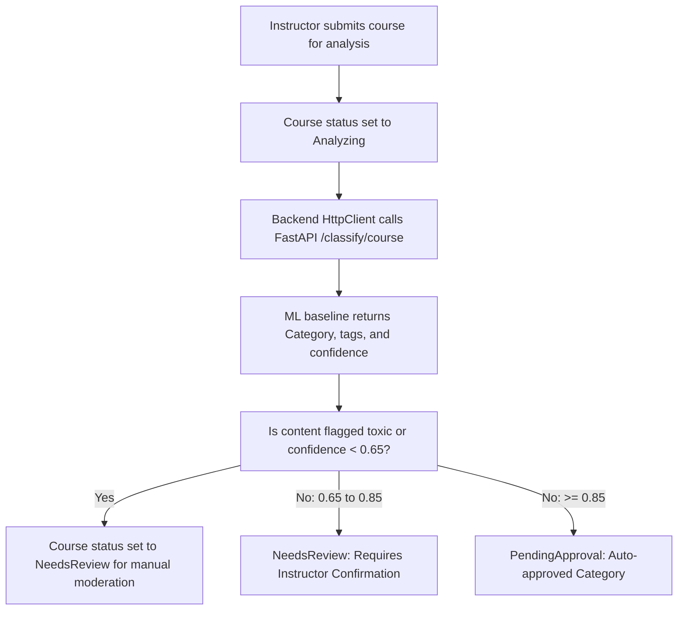

# EduMy eLearning Platform Walkthrough

We have successfully built and expanded the **EduMy** online learning platform. The system operates on separate concerns: ASP.NET Core (Backend API Orchestration), React (Visual Frontend Web Application), and FastAPI (Automated Text Processing & ML Analytics).

---

## 1. List of Implemented Features

### Phase 1: Core Database & Foundations
- **Search Histories & User Activities Tracking:** Created database schemas to monitor user search terms and student event flows.
- **Enhanced Database Seeder:** Added 1 System Admin, 3 Instructors, 10 Student learners, 8 Categories, and 20+ complete Courses with multi-tier lesson plans, enrollments, reviews, and transaction records.

### Phase 2: Secure Accounts & Password Recovery
- **Security Validation:** Integrated server-side validations using Data Annotations (Model validation triggers) for registration, login, and recovery.
- **Mock Recovery Workflow:** Built `/auth/forgot-password` and `/auth/reset-password` endpoints generating secure recovery tokens and outputting links to developer logs to bypass SMTP setup.

### Phase 3: Machine Learning & Content Moderation
- **Auto-Categorization Rules:** Automatically maps course categories on "Analyzing" status trigger:
  - `Confidence < 0.65`: Sets state to `NeedsReview` / `NeedsManualReview`.
  - `0.65 <= Confidence < 0.85`: Requires Instructor Confirmation.
  - `Confidence >= 0.85`: Auto-approves Category mapping.
- **Toxicity Content Lock:** Flags courses as `NeedsReview` with `High` risk levels if content matches toxic words.
- **Vietnamese Slug Generator:** Converts letters with accents to non-accent counterparts to yield readable URLs.
- **Admin Control Overrides:** Added status updates, user blocking, and override methods to override predicted ML values.
- **Instructor Dashboard Extensions:** Enabled monthly charts tracking sales, sentiment aggregates, and quality improvement alerts.

---

## 2. System Architecture

```text
       [ EduMy Client (Vite + React) ]
                   |
                   |  HTTP REST
                   v
    [ ASP.NET Core API Gateways ] <---- JWT Token (HttpOnly Cookie Rotation)
       |           |
       | EF Core   | HTTP REST / Polly Resilience
       v           v
 [SQL Server]   [FastAPI ML Service (Python)]
```

---

## 3. Database Schema Layout

The database includes the following key tables and relations:
- `Users` & `Roles`: Linked via `UserRoles` join table. Supports properties `IsActive`, `ResetToken`, and `ResetTokenExpiry`.
- `Courses`: Linked to `Users` (Instructor) and `Categories` (Parent/Child hierarchies). Tracks state (`Draft`, `Analyzing`, `NeedsReview`, `PendingApproval`, `Published`).
- `CourseMlAnalyses` & `CourseMlAnalysisTags`: Stores history logs of AI predictions.
- `SearchHistories` & `UserActivities`: Tracks user behaviour patterns.
- `Quizzes`, `Questions`, `Answers`, `QuizAttempts`, `QuizAttemptAnswers`: Handles student assessment progress.

---

## 4. Workflows

### Authentication Flow
1. **Register:** Student submits credentials. Password hashed using BCrypt.
2. **Login:** Server verifies password hash and returns short-lived JWT Access Token.
3. **Cookie Rotation:** Refresh Token is set inside an `HttpOnly`, `Secure` Cookie.
4. **Forgot Password:** Submitting email returns an 8-character token (written to logs).
5. **Reset:** Submitting email, token, and new password updates credentials.

### Machine Learning Classification Flow


---

## 5. Execution Instructions

### Option A: Running with Docker Compose (Recommended)
1. In the project root, launch all containers:
   ```bash
   docker-compose up -d --build
   ```
2. The UI is served at: `http://localhost`
3. Backend Swagger UI is at: `http://localhost:5000/swagger`
4. FastAPI status: `http://localhost:8000/health`

### Option B: Running Manually
1. **Database & API:**
   - In `Backend/appsettings.json`, set your SQL Server connection string.
   - Run:
     ```bash
     cd Backend
     dotnet run
     ```
   - Standard local URL: `http://localhost:5150`

2. **ML Service:**
   - Run:
     ```bash
     cd MLService
     pip install -r requirements.txt
     uvicorn main:app --reload --port 8000
     ```

3. **Frontend Client:**
   - Run:
     ```bash
     cd Frontend
     npm install
     npm run dev
     ```

---

## 6. Seed Accounts for Testing
- **Admin Account:** `admin@edumy.com` / `Admin@123`
- **Instructor Account:** `instructor@edumy.com` / `Instructor@123`
- **Student Account:** `student@edumy.com` / `Student@123`
